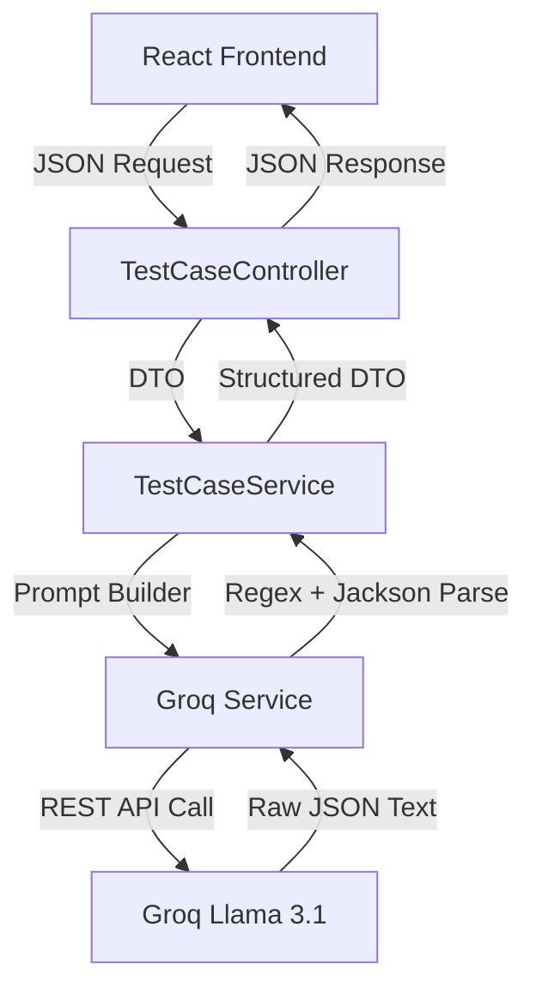

# TestPilot AI 🚀

**An AI-Powered REST API Test Case Generator**

TestPilot AI is a full-stack web application designed to automate the creation of API test cases. By simply providing an HTTP method, endpoint, and a brief description, the application uses **Groq AI (Llama 3.1)** to instantly generate structured positive, negative, and validation test cases.

This project was built to demonstrate backend API integration, prompt engineering, and clean, layered architecture in **Java & Spring Boot**.

---

## 🎯 Project Highlights

1. **AI Integration via RESTful APIs:** Instead of using bulky SDKs, the backend communicates directly with Groq's high-speed OpenAI-compatible REST API using Spring's `RestTemplate`.
2. **Robust JSON Parsing Strategy:** Large Language Models (LLMs) can sometimes return unpredictable formats (like markdown code blocks). The backend uses a custom, multi-step parsing strategy (Regex + Jackson `ObjectMapper`) to guarantee the frontend never crashes due to bad AI output.
3. **Prompt Engineering:** The AI is strictly instructed via a carefully designed system prompt to generate specific edge-cases (like 1-character boundaries, nulls, and empty fields) and output them in a strict JSON schema.
4. **Clean Architecture:** The Java backend strictly follows a layered architecture (Controller → Service → API layer) using Data Transfer Objects (DTOs) to decouple the AI response from the client payload.

---

## ⚙️ How it Works (The Architecture)

### System Architecture Diagram


### Project Structure
```text
SmartAPITester/
├── backend/                  # Spring Boot Java Application
│   ├── src/main/java/.../testpilot/
│   │   ├── controller/       # Exposes REST endpoints to React
│   │   ├── dto/              # Data Transfer Objects (Request/Response)
│   │   ├── exception/        # Global Error Handling
│   │   └── service/          # Business logic & AI Prompt Engineering
│   └── src/main/resources/   # App Config & Environment Variables
│
└── frontend/                 # React UI Application
    ├── src/
    │   ├── components/       # InputForm & ResultSection (Postman UI)
    │   ├── services/         # Axios API Client
    │   ├── App.jsx           # Main State Manager
    │   └── index.css         # Global Theme Variables
    └── package.json          # Node Dependencies
```

### Data Flow
1. **The Request:** The user enters API details in the React frontend (Postman-inspired UI).
2. **The Controller:** The React app sends a JSON payload to the Spring Boot `TestCaseController`.
3. **The Prompt:** The `TestCaseService` takes the user data and injects it into a strict instruction prompt engineered for a Senior QA Engineer persona.
4. **The AI Call:** The `GeminiService` (now powered by Groq) sends the prompt to the Groq LLM API.
5. **The Parsing:** The backend receives a raw text response, strips away any markdown artifacts, and safely deserializes the string into Java objects (`TestCaseResponse`).
6. **The Result:** The frontend receives the clean JSON and displays it in a 3-column grid, allowing the user to download the final test suite.

---

## 🛠️ Tech Stack

### Backend (The Core)
* **Java 21**
* **Spring Boot** (Web starter)
* **Maven** (Dependency management)
* **Groq API** (Llama 3.1 8B Instant Model)
* **Jackson** (JSON serialization/deserialization)

### Frontend (The UI)
* **React 18** (Built with Vite)
* **Axios** (HTTP client for connecting to the backend)
* **Vanilla CSS** (Custom Postman-inspired dark theme)

*(Note: To keep the project lightweight and focused purely on AI integration, there is no database, no authentication, and no heavy UI frameworks like Tailwind or Material UI).*

---

## 🚀 Local Setup Instructions

Want to run this on your own machine? Follow these steps:

### 1. Prerequisites
* Java 21+ installed
* Node.js & npm installed
* A free [Groq API Key](https://console.groq.com/keys)

### 2. Start the Backend (Spring Boot)
Open a terminal, navigate to the `backend` folder, and set your API key as an environment variable:

**Windows (PowerShell):**
```powershell
$env:GROQ_API_KEY="gsk_your_api_key_here"
mvn spring-boot:run
```
**Mac/Linux:**
```bash
export GROQ_API_KEY="gsk_your_api_key_here"
mvn spring-boot:run
```
*The backend will start on `http://localhost:8080`*

### 3. Start the Frontend (React)
Open a second terminal, navigate to the `frontend` folder, and run:
```powershell
npm install
npm run dev
```
*The frontend will open at `http://localhost:5173`*

---

## 🔮 Future Enhancements
* **Web Deployment:** Deploy the frontend and backend to the web so users can access the tool publicly without local setup.