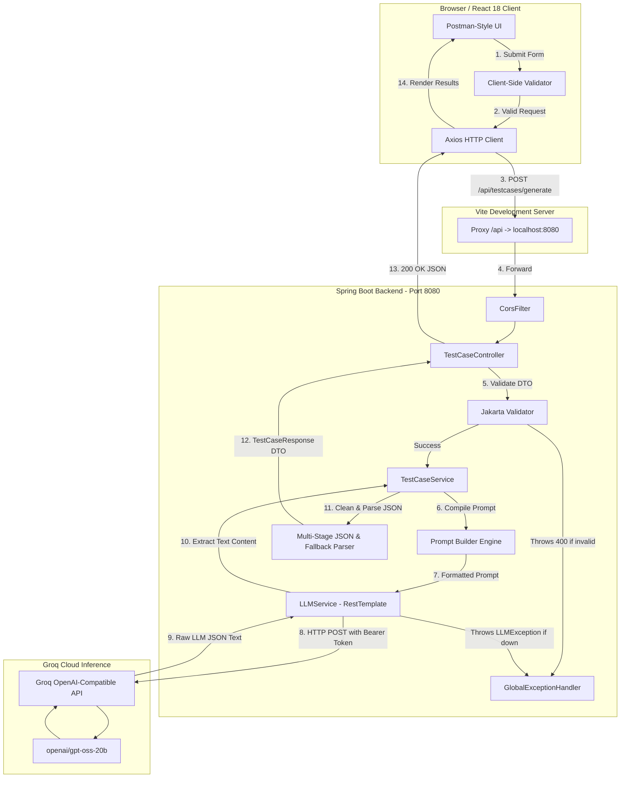
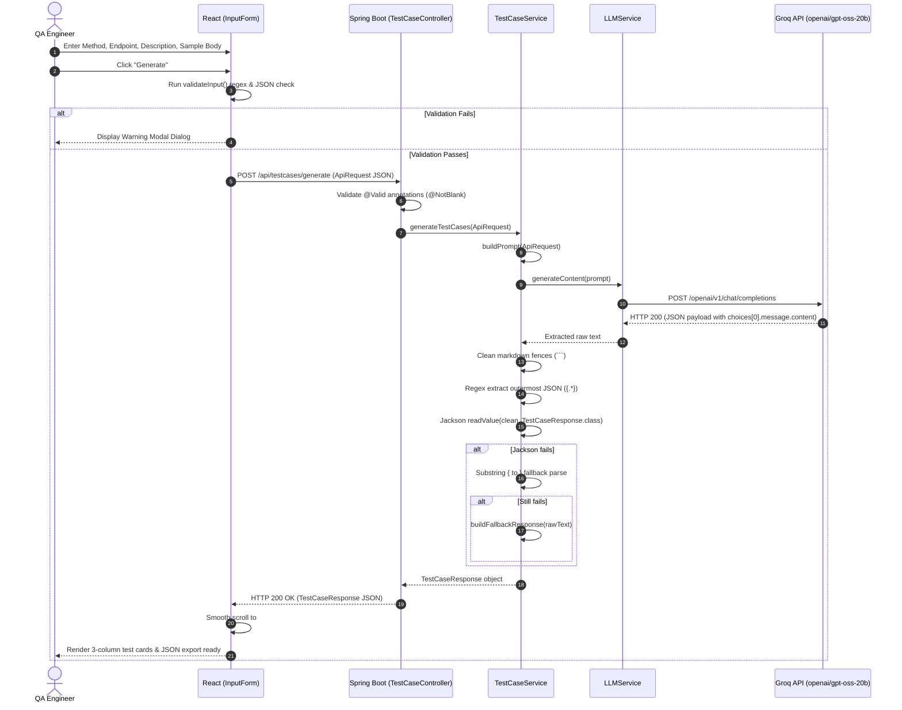

# TestPilot AI — Comprehensive Project Documentation

---

## 1. Executive Overview

**TestPilot AI** is a full-stack, AI-augmented developer tool built to automate the generation of exhaustive REST API test suites. By providing an HTTP method, endpoint path, natural-language API description, and an optional sample JSON request body, engineers can instantly obtain categorized test scenarios:

* **Positive Tests (Happy Paths):** Realistic, valid payloads verifying expected standard behavior.
* **Negative Tests (Sad Paths / Error States):** Invalid data types, malformed structures, and unprocessable entities.
* **Validation & Boundary Tests (Edge Cases):** Null checks, blank fields, whitespace strings, boundary-length inputs, and omitted required properties.
* **Expected HTTP Response Mappings:** Expected status codes (e.g., `200 OK`, `201 Created`, `400 Bad Request`, `404 Not Found`, `422 Unprocessable Entity`) paired with clear behavioral rationales.

### Core Philosophy & Architectural Intent

* **Layered Clean Architecture:** Strict decoupling across REST controllers, domain DTOs, business orchestration, and AI inference services.
* **Resilient AI Ingestion:** Built-in multi-tier regex and Jackson parsing fallback pipeline ensuring LLM formatting inconsistencies (such as markdown code fences or conversational preambles) never crash client interfaces.
* **Zero Bloat & High Performance:** Direct communication with the **Groq API** (`openai/gpt-oss-20b`) via Spring's `RestTemplate` avoiding heavy external SDK dependencies. The UI uses pure React and modular Vanilla CSS designed with a dark Postman aesthetic.

---

## 2. Technology Stack & Environment

### Backend
| Technology | Version / Spec | Purpose |
| :--- | :--- | :--- |
| **Java** | 21+ (configured for 26 in `pom.xml`) | Core runtime language |
| **Spring Boot** | 4.1.1 (`spring-boot-starter-web`) | Application container, REST API routing, lifecycle |
| **Spring Validation** | `spring-boot-starter-validation` | Declarative input validation (`@Valid`, `@NotBlank`) |
| **Jackson Databind** | 2.x (Spring Boot managed) | JSON serialization, deserialization, and schema binding |
| **Groq Cloud API** | REST API (`openai/gpt-oss-20b`) | Ultra-fast inference engine via OpenAI-compatible endpoint |
| **Maven** | 3.9+ | Dependency management and build packaging |

### Frontend
| Technology | Version / Spec | Purpose |
| :--- | :--- | :--- |
| **React** | 18.3.1 | Component-driven declarative UI library |
| **Vite** | 5.3.1 | Next-generation frontend build tool and dev server |
| **Axios** | 1.7.2 | Promise-based HTTP client for browser requests |
| **Vanilla CSS** | CSS3 custom properties (CSS variables) | Postman-inspired dark interface styling |
| **Google Fonts** | Inter & JetBrains Mono | Production-grade typography for UI text and code blocks |

---

## 3. High-Level Architecture & Data Flow

### 3.1 Architecture Diagram



### 3.2 Sequence of Operations



---

## 4. Directory Structure

```text
SmartAPITester/
├── .git/                                 # Git version control repository
├── .gitattributes                        # Git line ending configurations
├── .vscode/                              # VS Code editor settings
├── README.md                             # Quick-start documentation
├── documentation.md                      # Complete project documentation (this file)
│
├── backend/                              # Spring Boot Java Application
│   ├── pom.xml                           # Maven dependencies and build plugins
│   ├── .gitignore                        # Java/Maven ignore rules
│   └── src/
│       └── main/
│           ├── java/com/testpilot/
│           │   ├── TestPilotApplication.java        # Main Spring Boot bootstrap entry
│           │   ├── config/
│           │   │   └── CorsConfig.java              # Cross-Origin Resource Sharing bean
│           │   ├── controller/
│           │   │   └── TestCaseController.java      # REST endpoints (/generate, /download)
│           │   ├── dto/
│           │   │   ├── ApiRequest.java              # Client input payload DTO
│           │   │   ├── ExpectedResponse.java        # Status code mapping DTO
│           │   │   ├── TestCase.java                # Individual test case scenario DTO
│           │   │   └── TestCaseResponse.java        # Aggregated test generation response DTO
│           │   ├── exception/
│           │   │   ├── GlobalExceptionHandler.java  # ControllerAdvice for error mapping
│           │   │   └── LLMException.java            # Custom unchecked exception for AI failures
│           │   └── service/
│           │       ├── LLMService.java              # Groq API client via RestTemplate
│           │       └── TestCaseService.java         # Prompt engineering & multi-tier JSON parsing
│           └── resources/
│               └── application.properties           # Server port, Groq credentials, logging
│
└── frontend/                             # React UI (Vite Single Page Application)
    ├── index.html                        # HTML entry point with Google Fonts
    ├── package.json                      # npm scripts, React 18, Axios, Vite dependencies
    ├── vite.config.js                    # Vite configuration with /api reverse proxy
    └── src/
        ├── main.jsx                      # React 18 createRoot bootstrap
        ├── App.jsx                       # Master state holder, layout, smooth scroll
        ├── App.css                       # Layout containers, loading bars, alerts
        ├── index.css                     # Postman dark theme variables, CSS reset
        ├── components/
        │   ├── InputForm.jsx             # Postman-style URL bar, method dropdown, tabs
        │   ├── InputForm.css             # Input form styling, tab animations, validation modal
        │   ├── ResultSection.jsx         # 3-column test grid, status pills, JSON exporter
        │   └── ResultSection.css         # Card designs, color badges, responsive grid
        └── services/
            └── apiService.js             # Axios client instance with 60s timeout
```

---

## 5. Backend Deep Dive

### 5.1 Configuration & Properties (`application.properties`)

```properties
server.port=8080
spring.application.name=testpilot-backend

# Groq API Configuration
groq.api.key=${GROQ_API_KEY}
groq.api.url=https://api.groq.com/openai/v1/chat/completions
groq.model=openai/gpt-oss-20b

# Logging Configuration
logging.level.root=WARN
logging.level.com.testpilot=INFO
```

* **`groq.api.key`**: Injected securely from system environment variable `GROQ_API_KEY`.
* **`groq.api.url`**: Official Groq endpoint compatible with OpenAI's Chat Completions format.
* **`groq.model`**: Defaults to `openai/gpt-oss-20b`, optimized for fast structured JSON outputs.

### 5.2 Cross-Origin Configuration (`CorsConfig.java`)

Configures a Spring `CorsFilter` bean:
* Allows origins from `http://localhost:5173` (Vite's default development port).
* Allows all standard HTTP headers (`*`).
* Allows all HTTP methods (`GET`, `POST`, `PUT`, `DELETE`, `OPTIONS`, `PATCH`).
* Applies across all paths (`/**`).

### 5.3 Data Transfer Objects (DTO Layer)

#### `ApiRequest.java`
Models the incoming payload from the client:
```java
@NotBlank(message = "HTTP method is required (e.g., GET, POST, PUT, DELETE)")
private String method;

@NotBlank(message = "API endpoint is required (e.g., /users)")
private String endpoint;

@NotBlank(message = "API description is required")
private String description;

private String requestBody; // Optional sample JSON body
```

#### `TestCase.java`
Represents an individual scenario generated by the AI:
```java
@JsonIgnoreProperties(ignoreUnknown = true)
public class TestCase {
    private String title;
    private String description;
    private String expectedStatus;
    private Object requestBody; // Supports dynamic JSON objects, maps, or primitives
}
```

#### `ExpectedResponse.java`
Defines an HTTP response prediction:
```java
public class ExpectedResponse {
    private String status;   // e.g. "200 OK", "400 Bad Request"
    private String message;  // Explanation of when this status occurs
}
```

#### `TestCaseResponse.java`
The aggregated response sent back to the frontend:
```java
@JsonIgnoreProperties(ignoreUnknown = true)
public class TestCaseResponse {
    private String summary;
    private List<TestCase> positiveTests;
    private List<TestCase> negativeTests;
    private List<TestCase> validationTests;
    private List<ExpectedResponse> expectedResponses;
}
```

### 5.4 REST Controller (`TestCaseController.java`)

Base path: `/api/testcases`

* **`POST /api/testcases/generate`**
  * Accepts: `@Valid @RequestBody ApiRequest request`
  * Action: Invokes `testCaseService.generateTestCases(request)`.
  * Returns: `ResponseEntity<TestCaseResponse>` (HTTP 200 OK).

* **`GET /api/testcases/download`**
  * Accepts: `@RequestParam String content`
  * Action: Returns text payload with headers:
    * `Content-Disposition: attachment; filename=TestCases.txt`
    * `Content-Type: text/plain`
  * Returns: Downloadable file attachment.

### 5.5 Error Handling (`GlobalExceptionHandler.java` & `LLMException.java`)

* **`MethodArgumentNotValidException` (HTTP 400 Bad Request):**
  Extracts field-level validation errors (e.g., missing `method`, blank `endpoint`) and returns a map of `{ "field": "error message" }`.
* **`LLMException` (HTTP 503 Service Unavailable):**
  Catches Groq API outages, missing API keys, or upstream timeouts and returns `{ "error": "<reason>" }`.
* **`Exception` (HTTP 500 Internal Server Error):**
  Generic catch-all returning `{ "error": "An unexpected error occurred. Please try again." }`.

### 5.6 Groq Inference Service (`LLMService.java`)

* Instantiates a Spring `RestTemplate` and Jackson `ObjectMapper`.
* Constructs an OpenAI-compatible JSON payload:
  ```json
  {
    "model": "openai/gpt-oss-20b",
    "messages": [
      { "role": "user", "content": "<engineered_prompt>" }
    ],
    "temperature": 0.7,
    "max_tokens": 2048
  }
  ```
* Sets `Authorization: Bearer ${GROQ_API_KEY}` and `Content-Type: application/json`.
* Parses response tree to `choices[0].message.content`.
* If empty or null, raises a descriptive `LLMException`.

### 5.7 Prompt Engineering & Parsing Engine (`TestCaseService.java`)

#### Prompt Template
```text
You are a Senior QA Engineer. Generate test cases for the REST API below.

HTTP Method : %s
Endpoint    : %s
Description : %s
Sample Body : %s

Output ONLY a single, valid JSON object — no markdown, no code fences, no extra text.

Rules:
1. Each test case must have: "title", "description", "expectedStatus", "requestBody".
2. "requestBody" must be a JSON object unique to that test case — matching exactly what that scenario tests:
   - Positive   → complete valid data (real names, valid emails like alice@example.com).
   - Negative   → invalid values (wrong types, bad email like "not-an-email", numeric where string needed).
   - Validation → edge cases: omit required fields, use empty string "", use null, use " " (spaces only).
3. Do NOT repeat the same requestBody in two test cases.
4. Generate 4 test cases per category (positive, negative, validation).
5. expectedStatus must be a short string like "200 OK" or "400 Bad Request".

JSON format to follow exactly:
{
  "summary": "string",
  "positiveTests": [
    { "title": "string", "description": "string", "expectedStatus": "string", "requestBody": {} }
  ],
  "negativeTests": [
    { "title": "string", "description": "string", "expectedStatus": "string", "requestBody": {} }
  ],
  "validationTests": [
    { "title": "string", "description": "string", "expectedStatus": "string", "requestBody": {} }
  ],
  "expectedResponses": [
    { "status": "string", "message": "string" }
  ]
}
```

#### Multi-Tier JSON Parsing Strategy
LLM responses can contain unexpected markdown or text. `TestCaseService.parseResponse()` implements a 5-step sanitization sequence:

1. **Step 1 (Markdown Fence Stripping):** Uses regex `(?s)^```[a-zA-Z]*\s*` and `(?s)\s*```$` to strip ````json ... ```` markers.
2. **Step 2 (Outermost Object Isolation):** Uses regex `(?s)\{.*\}` to isolate the JSON object if the model prefixed or suffixed conversational greetings.
3. **Step 3 (Lenient Deserialization):** Configured Jackson `ObjectMapper` with:
   * `FAIL_ON_UNKNOWN_PROPERTIES = false`
   * `FAIL_ON_NULL_FOR_PRIMITIVES = false`
   * `ACCEPT_EMPTY_STRING_AS_NULL_OBJECT = true`
4. **Step 4 (Substring Boundary Extraction):** If step 3 fails, locates literal first `{` and last `}` indices and attempts parsing the sliced substring.
5. **Step 5 (Fallback Response Generator):** If all parsing fails, builds a clean `TestCaseResponse` containing the raw output in `summary` and empty arrays, guaranteeing the client UI renders gracefully rather than failing with an unhandled exception.

---

## 6. Frontend Deep Dive

### 6.1 Build & Development Configuration (`vite.config.js`)

```javascript
export default defineConfig({
  plugins: [react()],
  server: {
    port: 5173,
    proxy: {
      '/api': {
        target: 'http://localhost:8080',
        changeOrigin: true
      }
    }
  }
})
```
* **Reverse Proxy:** During local development, browser calls to `/api/...` are proxied to `http://localhost:8080`. This prevents CORS issues in local testing and eliminates hardcoded URLs in frontend services.

### 6.2 API Service (`apiService.js`)

* Centralized Axios client configured with `baseURL: '/api'` and a `60000ms` (60 seconds) timeout to accommodate LLM token generation latency.
* Exposes `generateTestCases(requestData)`.

### 6.3 State Management & Layout (`App.jsx`)

* **State Variables:**
  * `isLoading` (boolean): Controls loading bars, disables input forms, toggles button states.
  * `result` (`TestCaseResponse` object): Contains parsed test results.
  * `error` (string): Error message from failed network requests or backend validation.
  * `lastRequest` (object): Stores the exact input parameters (`method`, `endpoint`, `description`, `requestBody`) to include in exported JSON files.
* **Smooth Scrolling:** On successful generation, automatically invokes `document.getElementById('results')?.scrollIntoView({ behavior: 'smooth' })`.
* **Component Composition:**
  * `<header class="app-header">`: Branding, logo icon, version tag (`v1.0`).
  * `<InputForm>`: Postman-style request builder.
  * Loading state indicator with animated progress bar.
  * Error alert banner with dismissal logic.
  * `<ResultSection>`: Rendered test suites and export controls.
  * `<footer class="app-footer">`: Architecture and credits.

### 6.4 Postman-Inspired Request Builder (`InputForm.jsx`)

* **Method Selector:** Dropdown supporting `GET`, `POST`, `PUT`, `PATCH`, and `DELETE`, dynamically styled with distinct method color classes (`method-get`, `method-post`, etc.).
* **Endpoint Field:** Text input placeholder `Enter request URL (e.g. /api/users)`.
* **Send/Generate Button:** Includes spinning indicator and text change during `isLoading`.
* **Tabbed Interface:**
  * **Description Tab:** Multi-line textarea for functional API behavior.
  * **Body Tab:** Monospace textarea for sample JSON body with syntax hint.
  * Visual indicators (dots) indicate whether tabs contain user data.
* **Client-Side Validation (`validateInput`):**
  * Verifies endpoint begins with `/` and contains valid URL characters.
  * Verifies description has at least 5 alphanumeric characters.
  * Validates JSON syntax of `requestBody` using `JSON.parse()` if provided.
  * Triggers an accessible modal dialog if validation fails.

### 6.5 Results & Export Engine (`ResultSection.jsx`)

* **API Summary:** Card displaying high-level summary of the endpoint's purpose and scope.
* **3-Column Test Grid:**
  * **Positive Tests:** 4 scenarios with expected `2xx` status codes.
  * **Negative Tests:** 4 scenarios testing malformed input, invalid types, or invalid endpoints.
  * **Validation Tests:** 4 edge cases testing missing parameters, empty strings, or nulls.
* **Card Rendering (`TestColumn` & `test-card`):**
  * Formatted two-digit index (`01`, `02`, ...).
  * Scenario title and detailed step-by-step description.
  * Dynamic status chip styled according to HTTP class:
    * `status-2xx`: Green badge.
    * `status-4xx`: Orange/yellow badge.
    * `status-5xx`: Red badge.
* **Expected Responses Table:** List of HTTP codes and when the API returns each.
* **JSON Export (`handleDownload`):**
  Generates a formatted, downloadable file `TestCases.json` containing:
  * Tool metadata & ISO 8601 generation timestamp.
  * Full API request context (method, endpoint, description, parsed body).
  * Generated summary.
  * Categorized test cases enriched with individual test case bodies.
  * Expected response code mappings.

---

## 7. Complete API Reference

### 7.1 Generate Test Cases

* **Endpoint:** `POST /api/testcases/generate`
* **Content-Type:** `application/json`

#### Request Payload
```json
{
  "method": "POST",
  "endpoint": "/api/v1/auth/register",
  "description": "Registers a new user account with email, username, and password. Requires valid email format and password with minimum 8 characters.",
  "requestBody": "{\n  \"email\": \"user@example.com\",\n  \"username\": \"johndoe\",\n  \"password\": \"SecurePass123!\"\n}"
}
```

#### Field Constraints
| Field | Type | Required | Rules / Notes |
| :--- | :--- | :--- | :--- |
| `method` | String | Yes | Not blank (e.g. `GET`, `POST`, `PUT`, `DELETE`) |
| `endpoint` | String | Yes | Not blank (e.g. `/api/v1/users`) |
| `description`| String | Yes | Not blank; explains API behavior |
| `requestBody`| String | No | Optional; sample request body string |

#### Successful Response (HTTP 200 OK)
```json
{
  "summary": "The /api/v1/auth/register endpoint creates user accounts, requiring strict email validation and complex passwords.",
  "positiveTests": [
    {
      "title": "Successful User Registration",
      "description": "Submit complete and valid registration data with unique credentials.",
      "expectedStatus": "201 Created",
      "requestBody": {
        "email": "jane.doe@example.com",
        "username": "janedoe",
        "password": "ValidPassword123!"
      }
    }
  ],
  "negativeTests": [
    {
      "title": "Invalid Email Format",
      "description": "Submit registration payload containing a malformed email address.",
      "expectedStatus": "400 Bad Request",
      "requestBody": {
        "email": "not-an-email",
        "username": "janedoe",
        "password": "ValidPassword123!"
      }
    }
  ],
  "validationTests": [
    {
      "title": "Missing Required Password Field",
      "description": "Omit the password key entirely from the JSON payload.",
      "expectedStatus": "400 Bad Request",
      "requestBody": {
        "email": "jane.doe@example.com",
        "username": "janedoe"
      }
    }
  ],
  "expectedResponses": [
    {
      "status": "201 Created",
      "message": "User account created successfully."
    },
    {
      "status": "400 Bad Request",
      "message": "Validation failed due to invalid email format or missing required fields."
    },
    {
      "status": "409 Conflict",
      "message": "Email or username is already taken."
    }
  ]
}
```

#### Error Responses

* **Validation Failure (HTTP 400 Bad Request):**
  ```json
  {
    "endpoint": "API endpoint is required (e.g., /users)",
    "method": "HTTP method is required (e.g., GET, POST, PUT, DELETE)"
  }
  ```

* **Upstream LLM Service Failure (HTTP 503 Service Unavailable):**
  ```json
  {
    "error": "Failed to communicate with LLM API. Please check your API key and try again. Details: 401 Unauthorized"
  }
  ```

* **Server Failure (HTTP 500 Internal Server Error):**
  ```json
  {
    "error": "An unexpected error occurred. Please try again."
  }
  ```

### 7.2 Download Test Cases (Raw Text)

* **Endpoint:** `GET /api/testcases/download?content={content}`
* **Response Headers:**
  * `Content-Disposition: attachment; filename=TestCases.txt`
  * `Content-Type: text/plain`
* **Response Body:** Echoes raw text content as a downloadable file.

---

## 8. Design System & Theme Specifications

The user interface follows a Postman-inspired dark developer theme using CSS custom properties defined in `frontend/src/index.css`:

### 8.1 Color Palette

| Token Name | Hex Value | Semantic Usage |
| :--- | :--- | :--- |
| `--bg-primary` | `#1c1c1c` | Body background, root viewport canvas |
| `--bg-secondary` | `#252525` | Panel containers, URL bar wrapper |
| `--bg-card` | `#2c2c2c` | Test scenario cards, summary cards |
| `--bg-hover` | `#343434` | Interactive button and card hover state |
| `--bg-input` | `#1c1c1c` | Form input and textarea backgrounds |
| `--accent-orange`| `#ff6c37` | Primary brand accent (Postman orange), primary actions |
| `--accent-green` | `#28a745` | Positive test badges, 2xx HTTP success status pills |
| `--accent-red` | `#e05252` | Negative test badges, 5xx server error pills, alerts |
| `--accent-yellow`| `#f0ad4e` | Validation test badges, 4xx client error pills |
| `--accent-blue` | `#4a90d9` | Secondary accents, link hovers |
| `--text-primary` | `#ebebeb` | High-contrast body text and titles |
| `--text-secondary`| `#aaaaaa`| Subheadings, field labels, metadata |
| `--text-muted` | `#666666` | Disabled states, placeholders, card index numbers |
| `--border-default`| `#383838`| Card outlines, divider rules, tab borders |

### 8.2 Typography

* **Sans-Serif Font:** `'Inter', -apple-system, BlinkMacSystemFont, sans-serif` (UI controls, labels, titles, descriptions).
* **Monospace Font:** `'JetBrains Mono', 'Fira Code', monospace` (URL paths, HTTP methods, JSON code blocks).

---

## 9. Local Setup & Execution Guide

### 9.1 Prerequisites
1. **Java Development Kit (JDK):** Version 21 or higher. Verify with:
   ```bash
   java -version
   ```
2. **Node.js & npm:** Node 18+ and npm 9+. Verify with:
   ```bash
   node -v
   npm -v
   ```
3. **Groq API Key:** Free API key from [Groq Console](https://console.groq.com/keys).

---

### 9.2 Backend Setup

1. Open a terminal and navigate to `backend/`:
   ```bash
   cd backend
   ```

2. Set the `GROQ_API_KEY` environment variable:

   * **Windows (PowerShell):**
     ```powershell
     $env:GROQ_API_KEY="gsk_your_actual_groq_api_key_here"
     ```
   * **Windows (CMD):**
     ```cmd
     set GROQ_API_KEY=gsk_your_actual_groq_api_key_here
     ```
   * **macOS / Linux:**
     ```bash
     export GROQ_API_KEY="gsk_your_actual_groq_api_key_here"
     ```

3. Build and launch the application:
   ```bash
   mvn spring-boot:run
   ```
   *The backend will initialize and listen on `http://localhost:8080`.*

---

### 9.3 Frontend Setup

1. Open a second terminal and navigate to `frontend/`:
   ```bash
   cd frontend
   ```

2. Install dependencies:
   ```bash
   npm install
   ```

3. Start the Vite development server:
   ```bash
   npm run dev
   ```
   *The frontend will run at `http://localhost:5173` with automatic API proxying.*

---

## 10. Security & Robustness Considerations

1. **Credential Secrecy:**
   The `GROQ_API_KEY` is loaded from an environment variable and never committed to source control or exposed to the client bundle.
2. **Fail-Safe Deserialization:**
   The LLM parser uses multi-step fallback recovery. If the AI returns malformed JSON or markdown fences, the backend strips wrappers, isolates matching curly braces, and falls back to a structured default response if needed, preventing 500 errors on the frontend.
3. **Double-Layer Input Validation:**
   * Frontend: Regex verification on endpoint format and JSON syntax validation on the body.
   * Backend: Spring Jakarta Bean Validation (`@Valid`, `@NotBlank`) on incoming DTO fields.
4. **Network Timeout Guard:**
   The frontend Axios client enforces a `60000ms` timeout to handle network interruptions or upstream latency cleanly.

---

## 11. Troubleshooting & FAQ

### Issue: `Failed to communicate with LLM API (401 Unauthorized)`
* **Cause:** The `GROQ_API_KEY` environment variable is either unset, empty, or invalid.
* **Resolution:** Ensure the environment variable is exported in the exact terminal session executing `mvn spring-boot:run`:
  ```powershell
  echo $env:GROQ_API_KEY
  ```

### Issue: `CORS Policy Blocked`
* **Cause:** Frontend accessed from an origin other than `http://localhost:5173`.
* **Resolution:** Update `CorsConfig.java` to include your origin, or access the frontend via `http://localhost:5173`.

### Issue: Port 8080 Already in Use
* **Cause:** Another service is using port 8080.
* **Resolution:** Change the port in `backend/src/main/resources/application.properties`:
  ```properties
  server.port=8081
  ```
  Then update the proxy target in `frontend/vite.config.js`:
  ```javascript
  proxy: {
    '/api': {
      target: 'http://localhost:8081',
      changeOrigin: true
    }
  }
  ```

---

## 12. Future Roadmap

1. **Direct API Execution:** Ability to run the generated test suite directly against a live server endpoint and display actual vs. expected responses.
2. **Export Formats:**
   * Postman Collection v2.1 export format (`.json`).
   * OpenAPI / Swagger specification export (`.yaml` / `.json`).
   * Automated test script generation (Jest/Supertest, Playwright, or RestAssured).
3. **Database & Test History:** Optional persistent test history using PostgreSQL or SQLite.
4. **Cloud Deployment:** Containerization via Docker & Docker Compose for single-command deployment.
